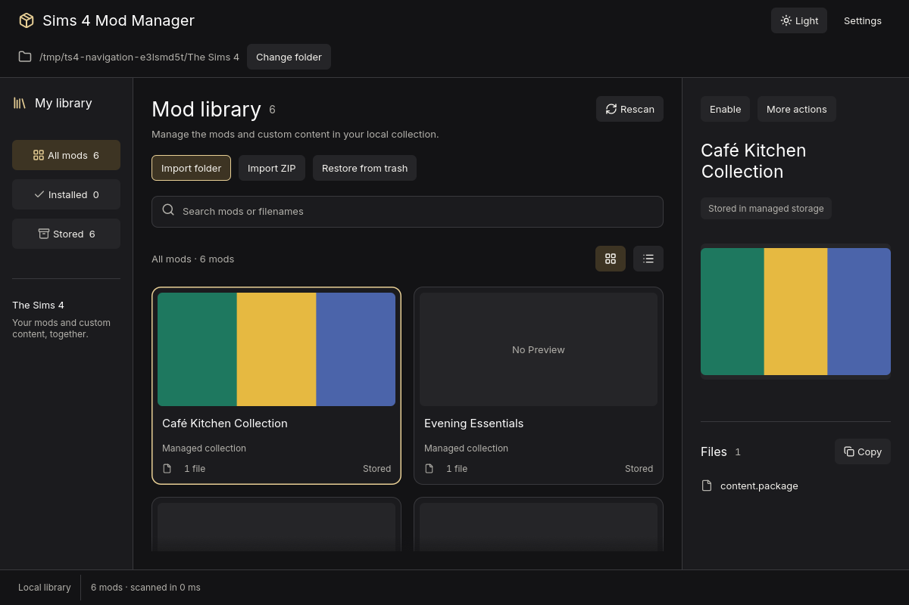

  

# Sims 4 Mod Manager

Your Sims 4 mods and custom content, organized on your Linux desktop.

Browse your collection by photo, find a file by name, and choose which mods are active in your game. Keep downloaded mods in a local library, with reviewed changes and recoverable trash.

[Getting started](#getting-started) · [Documentation](docs/README.md) · [Report a bug](https://github.com/VitorCesarinoMarchese/TS4ModManager/issues) · [Releases](https://github.com/VitorCesarinoMarchese/TS4ModManager/releases)

*The app running with sample mods. The screenshot uses synthetic test data.*

## What you can do

| Feature | What you can do |
| --- | --- |
| Browse your collection | Switch between photo cards and a compact list. Search mod names and filenames, or filter installed and stored mods. |
| Bring your own mods | Import a local folder or ZIP archive, or review existing game mods before moving them into the managed library. |
| Choose what loads | Review the files before enabling or disabling a managed mod. |
| Keep track of sources | Save a source link yourself, or review CurseForge suggestions and confirm a match. |
| Recover removed mods | Move managed mods to trash and review where they will go before restoring them. |
| Make it yours | Choose light, dark, or system appearance, create a custom theme, and remember your game folders. |

## Alpha 0.01

The first alpha, **0.01**, is being prepared. Expect rough edges and report problems before relying on the app for your main collection.

Linux is the current supported platform. Windows and macOS have not been verified. Release downloads will appear on the [releases page](https://github.com/VitorCesarinoMarchese/TS4ModManager/releases) when published. Until then, use the [build and run guide](docs/development.md#run-the-app).

The app manages mods you already have. It does not download or update them. CurseForge lookup is optional and needs your own API key in local Settings. Suggestions are saved only after you confirm them, and weak matches show a warning.

## Getting started

1. Open the app and choose your **The Sims 4** folder, the folder containing **Mods**. Use **Change folder** if the detected location is wrong.
2. Browse your existing mods, or select **Import folder** or **Import ZIP** to add files you have downloaded.
3. Select a managed mod to inspect its files. Choose **Enable** or **Disable**, review the proposed changes, and confirm.
4. Right-click a mod for more actions. Use **Restore from trash** to recover a removed managed mod.

See the [app guide](docs/native-app.md) for settings, themes, source lookup, and folder selection.

## Your files stay yours

Your library and settings stay on your computer. Local browsing and mod management work without CurseForge. Optional source lookup and remote preview images use network requests.

Management actions require review. The app checks ownership before removing its links, leaves unmanaged files alone, and moves removed managed mods to recoverable trash. Read the [storage and safety details](docs/development.md#local-storage-and-safety) for locations and recovery behavior.

## Help and contribute

[Open an issue](https://github.com/VitorCesarinoMarchese/TS4ModManager/issues) with what you expected, what happened, your Linux distribution, and steps to reproduce the problem. Screenshots help. Keep API keys and private file paths out of reports.

For code contributions, follow the [development and validation guide](docs/development.md). Architecture, safety contracts, packaging instructions, and past migration reports live in [docs](docs/README.md).

Sims 4 Mod Manager is an independent project and is not affiliated with Electronic Arts or Maxis.
