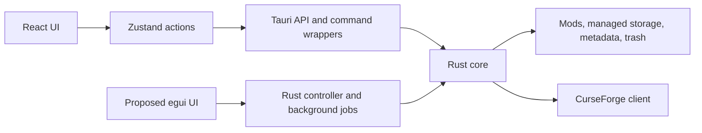

# Fastframe rewrite investigation

Historical record from before the React/Tauri app was retired. Source paths and validation commands describe that revision. The current app lives in `native/`, with its Rust library in `core/`. See the [current setup instructions](../README.md).

Investigated on 2026-10-08. Project revision: `f000b8547e315d23e013a9d0252b2cb103a9428f`. Fastframe revision: `bb79dbddef01e660f9cfc37ccd9dff1c299a8d47`.

A native Rust UI is feasible. My recommendation is to retain and repair the Rust core, then test an egui UI with selected Fastframe crates alongside the existing app. A complete rewrite of filesystem and provider logic would discard useful behavior and tests without addressing the causes of the current bugs.

Your experience of other Fastframe apps is a useful reason to try it. It does not establish that this app will become faster. This investigation includes source inspection, executable bug reproductions, existing validation, and a browser development smoke check. It does not include a native Fastframe prototype or comparative performance measurements.

Fastframe's role and fit

Fastframe is a collection of desktop libraries for egui apps. It supplies shared desktop behavior; the application still owns its layout and product logic. Adoption here means replacing React, CSS, Zustand, and the Tauri shell with an egui/eframe application. It is not a frontend dependency we can install into the existing React app. [Fastframe overview](https://github.com/crmne/fastframe/blob/bb79dbddef01e660f9cfc37ccd9dff1c299a8d47/docs/_guide/what-is-fastframe.md).

| Concern | Fit for TS4 Mod Manager | Work still owned by this app |
| --- | --- | --- |
| Fonts and text | `fastframe-fonts` and `fastframe-text` supply font fallback and desktop text rendering settings. | Text sizes, layout, truncation, and selectable filenames. |
| Icons and colors | `fastframe-icons` and `fastframe-theme` supply shared icons and palette infrastructure. | Mod cards, dialogs, custom theme schema compatibility, and mapping colors to widgets. |
| Scroll feel | `fastframe-scroll` adjusts wheel behavior and adds Linux touchpad momentum. | Efficiently render visible rows/cards and test real touchpad behavior. |
| Diagnostics | `fastframe-log` supplies per-run logs. | User-facing issues, operation histories, and redaction of credentials. |
| One app instance | `fastframe-instance` offers locking and launch handoff. | Decide which operations require exclusivity and how requests reach the controller. |
| Background residency | `fastframe-shell` supports closing and recreating windows while the app stays running. | Optional here. Plain eframe is sufficient if closing the window quits. |
| Updates | `fastframe-update` concerns updates to the application. | Optional. It does not implement mod updates. |

These capabilities come from the [crate inventory](https://github.com/crmne/fastframe/tree/bb79dbddef01e660f9cfc37ccd9dff1c299a8d47/crates). The [scroll crate](https://github.com/crmne/fastframe/blob/bb79dbddef01e660f9cfc37ccd9dff1c299a8d47/crates/fastframe-scroll/README.md) is particularly relevant to the responsive feel you described. I would begin with fonts, text, icons, scroll, and logging. Audio, media controls, tray residency, and self-updates are unnecessary for the first pilot.

The current workspace declares Rust 1.98, edition 2024, and egui/eframe 0.36.1. Our installed compiler is Rust 1.95.0. The current Fastframe revision therefore requires a toolchain upgrade before a build trial. The project's own Rust core uses edition 2021 and can remain a separate crate. [Pinned Fastframe manifest](https://github.com/crmne/fastframe/blob/bb79dbddef01e660f9cfc37ccd9dff1c299a8d47/Cargo.toml).

Fastframe describes its APIs as early and changing, and its crates are Git dependencies rather than crates.io packages. Pin one reviewed revision across all selected crates. The documentation also recommends coordinated egui and winit fork revisions for fixes that have not reached published releases. Stock versions are supported, but do not contain all those fixes. This adds dependency maintenance to the migration. [Fastframe README](https://github.com/crmne/fastframe/tree/bb79dbddef01e660f9cfc37ccd9dff1c299a8d47), [setup guide](https://github.com/crmne/fastframe/blob/bb79dbddef01e660f9cfc37ccd9dff1c299a8d47/docs/_guide/getting-started.md).

The largest likely benefit is removing the webview runtime and the JavaScript/Rust IPC boundary. It also removes this app's dependence on WebKitGTK and its documented Wayland workaround. Those are architectural benefits, not measured startup, memory, or latency improvements. Native rendering still needs GPU, scaling, keyboard, accessibility, and Wayland testing.

What carries over

Today a React action calls the Zustand store, which calls `createBackendApi`. Tauri wrappers resolve paths and call the Rust commands. The Rust core scans files, reads each managed mod's `meta.json`, maintains symlinks and trash, and performs provider lookup. Responses return through a TypeScript adapter and update the displayed catalog.

The separation already exists in Cargo.toml (`src-tauri/Cargo.toml` at the recorded revision). The core library has empty default features and an optional `tauri-app` feature. lib.rs (`src-tauri/src/lib.rs` at the recorded revision) exposes the modules independently of Tauri. Passing Rust structs directly would remove the current response-normalization layer.

| Keep, after repairing defects | Replace or adapt |
| --- | --- |
| Detection, scans, filename normalization, manifests, archive handling | React components, CSS, Framer Motion, Zustand actions |
| Source candidates, conservative scoring, provider/client separation | TypeScript API adapters and Tauri command bindings |
| `meta.json` compatibility and managed storage locations | Browser localStorage settings, clipboard, image loading, window controls |
| Toggle, migration, trash, restore behavior and Rust tests | Linux dialog/opener helpers as needed, release packaging, GUI tests |

The frontend contains roughly 3,325 non-test TypeScript lines. The Rust modules contain 6,729 lines including their embedded tests, excluding `tauri_commands.rs`, `main.rs`, and `lib.rs`. These are scope indicators, not an effort estimate. Most domain behavior is already Rust; nearly every visible interaction needs a new implementation and acceptance check.

The native controller should separate metadata edits from filesystem enabled state. Background results should carry the instance ID, mod ID, and request generation. A stale scan or lookup must not replace newer state. Blocking scans, imports, hashes, trash operations, and HTTP requests must run outside egui's frame callback. Worker completions can request a repaint.

Keep the existing data format initially. Export browser-stored settings through the old app before retiring it, then import into native settings. Do not assume a native executable can read Tauri's localStorage automatically. Any key transfer must stay local and outside mod metadata. Existing safety rules, explicit source attachment, conservative warnings, broken-image behavior, and request privacy must carry over.

Bug inventory

"Executed" means the existing implementation ran against controlled responses or temporary files. "Inspection" means the defect follows from the code, but its full scenario was not executed. Priorities reflect user impact rather than a formal security score. None of these defects was fixed as part of this investigation.

| ID | Priority / evidence | Trigger and observed or expected consequence | Source |
| --- | --- | --- | --- |
| B01 | High / executed | Migrate an external mod, then disable or uninstall it. Both fail with `Link sidecar malformed: missing field modId`. Migration writes `mod_id`, while both readers expect `modId`. | external_migration.rs:89 (`src-tauri/src/external_migration.rs#L89` at the recorded revision), toggle.rs:42 (`src-tauri/src/toggle.rs#L42` at the recorded revision), lifecycle.rs:34 (`src-tauri/src/lifecycle.rs#L34` at the recorded revision) |
| B02 | High / executed | Replace an enabled mod's symlink with one pointing outside managed storage, then disable. The app deletes that outside-pointing symlink and reports success. Its target file survives. Disable checks link type but not ownership. | toggle.rs:114 (`src-tauri/src/toggle.rs#L114` at the recorded revision), toggle.rs:206 (`src-tauri/src/toggle.rs#L206` at the recorded revision) |
| B03 | High / inspection | Find Source without an API key for an MCCC-like name. Production code returns a hard-coded candidate, project ID, image URL, and evidence through a fixture provider. These were not obtained from provider data. This violates the repository's source-candidate rules. | source_lookup.rs:35 (`src-tauri/src/source_lookup.rs#L35` at the recorded revision), source_lookup.rs:673 (`src-tauri/src/source_lookup.rs#L673` at the recorded revision) |
| B04 | High / executed | Enable two imports with `Shared/One.package` and `Shared/Two.package`. Scanning combines both files under the first managed identity, then presents the other mod as a metadata-only disabled entry. Ownership is lost through folder grouping. | mod_scan.rs:100 (`src-tauri/src/mod_scan.rs#L100` at the recorded revision), mod_scan.rs:201 (`src-tauri/src/mod_scan.rs#L201` at the recorded revision), mod_scan.rs:216 (`src-tauri/src/mod_scan.rs#L216` at the recorded revision) |
| B05 | High / executed | Successfully toggle a mod. The store neither updates its enabled state nor rescans. Two clicks on a displayed disabled mod request enable twice. An external mod also retains its old ID/source after migration. | appStore.ts:520 (`src/store/appStore.ts#L520` at the recorded revision), App.tsx:164 (`src/App.tsx#L164` at the recorded revision) |
| B06 | High / executed | Rename, attach a source, or remove a source on an enabled mod. Each response is normalized with `enabled: false`, then spread over the catalog entry. The card appears disabled while its files stay enabled. | backendApi.ts:39 (`src/lib/backendApi.ts#L39` at the recorded revision), appStore.ts:428 (`src/store/appStore.ts#L428` at the recorded revision), appStore.ts:454 (`src/store/appStore.ts#L454` at the recorded revision), appStore.ts:479 (`src/store/appStore.ts#L479` at the recorded revision) |
| B07 | High / executed | Start scan A, then scan B, and finish B before A. A's late completion restores A as selected. The indicator can say idle while another request is still running. Rescan has the same absence of request identity checks. | appStore.ts:218 (`src/store/appStore.ts#L218` at the recorded revision), appStore.ts:231 (`src/store/appStore.ts#L231` at the recorded revision) |
| B08 | Medium / executed | Delete an enabled mod's managed target and disable. The dangling symlink remains, with reported success and no issues. `exists()` follows the missing target. Uninstall uses the same faulty existence check. | toggle.rs:118 (`src-tauri/src/toggle.rs#L118` at the recorded revision), lifecycle.rs:358 (`src-tauri/src/lifecycle.rs#L358` at the recorded revision) |
| B09 | Medium / executed | Place managed data and trash on different mounts. Uninstall fails with `Invalid cross-device link`, because it uses `rename` without a cross-device strategy. Restore uses `rename` too. | lifecycle.rs:89 (`src-tauri/src/lifecycle.rs#L89` at the recorded revision), lifecycle.rs:105 (`src-tauri/src/lifecycle.rs#L105` at the recorded revision) |
| B10 | Medium / inspection | Restore a trash item containing `metadata/`. Installed files move back, but that directory is skipped. The app reports success and removes trash information, leaving metadata stranded instead of restoring it. | lifecycle.rs:173 (`src-tauri/src/lifecycle.rs#L173` at the recorded revision), lifecycle.rs:229 (`src-tauri/src/lifecycle.rs#L229` at the recorded revision) |
| B11 | Medium / inspection | A symlink unlink fails during disable. The error is ignored and the sidecar is removed anyway. Active links can remain without their bookkeeping while the app reports success. | toggle.rs:206 (`src-tauri/src/toggle.rs#L206` at the recorded revision) |
| B12 | Medium / inspection | Enable the same managed mod in two game instances, then disable it in one. `links.json` is shared per mod, without instance identity, and disable removes it. The other instance loses lifecycle bookkeeping. | toggle.rs:226 (`src-tauri/src/toggle.rs#L226` at the recorded revision), toggle.rs:247 (`src-tauri/src/toggle.rs#L247` at the recorded revision) |
| B13 | Medium / executed | Manage All migrates one mod and fails on the second. No rescan happens, so both still appear external. Progress is discarded even though filesystem changes already occurred. | appStore.ts:365 (`src/store/appStore.ts#L365` at the recorded revision) |
| B14 | Medium / executed and inspection | Initial detection rejects without adding an issue. Toggle errors also have no catch through the store/UI call chain. Users can get an unhandled rejection without a useful issue dialog. Initial detection was reproduced; toggle error handling was inspected. | appStore.ts:214 (`src/store/appStore.ts#L214` at the recorded revision), appStore.ts:520 (`src/store/appStore.ts#L520` at the recorded revision), App.tsx:123 (`src/App.tsx#L123` at the recorded revision), ModCard.tsx:61 (`src/components/ModCard.tsx#L61` at the recorded revision) |
| B15 | Medium / inspection | A path collision blocks a toggle. Fix the collision and rescan. The disabled-ID map is never cleared, so the toggle remains disabled. | App.tsx:118 (`src/App.tsx#L118` at the recorded revision), App.tsx:167 (`src/App.tsx#L167` at the recorded revision) |
| B16 | Medium / inspection | Import fails after submission. The form clears before awaiting the operation, so the user loses the entered path/name/slug. There is no in-flight submission guard. | ImportPanel.tsx:133 (`src/components/ImportPanel.tsx#L133` at the recorded revision) |
| B17 | Medium / inspection | Fix an orphan link and rescan. Old orphan warnings remain because scanning only merges issues. | appStore.ts:239 (`src/store/appStore.ts#L239` at the recorded revision) |
| B18 | Low / inspection | Change the OS color preference with System theme selected. The app has no preference-change listener, so the theme does not update promptly. | App.tsx:43 (`src/App.tsx#L43` at the recorded revision), App.tsx:120 (`src/App.tsx#L120` at the recorded revision) |
| B19 | Low / inspection | Show a success toast. It has no timer or dismiss action. Its wrapper relies on an animation-end event, but neither wrapper nor toast defines a CSS animation. | App.tsx:373 (`src/App.tsx#L373` at the recorded revision), Toast.tsx:7 (`src/components/Toast.tsx#L7` at the recorded revision) |

The Rust reproductions used a temporary harness compiled against the current source modules. They covered B01, B02, B04, B08, and B09, without real user files. Frontend reproductions transpiled the actual store/API in memory and used deferred or rejecting backend responses for B05, B06, B07, B13, and initial detection in B14. These were investigative probes, not committed regression tests.

Further risks to investigate before either release path

- Toggle writes ownership bookkeeping only after creating all links. A failure halfway through can leave partial installation without a sidecar. Migration also lacks rollback if replacement link creation fails. See toggle.rs:173 (`src-tauri/src/toggle.rs#L173` at the recorded revision) and external_migration.rs:96 (`src-tauri/src/external_migration.rs#L96` at the recorded revision).
- Import copies directly into final managed storage before writing metadata. An interrupted copy or metadata write can leave incomplete storage. See managed_storage.rs:102 (`src-tauri/src/managed_storage.rs#L102` at the recorded revision).
- Mod IDs and metadata-relative paths need containment validation at filesystem boundaries. Absolute paths or `..` components in externally edited metadata must not escape managed roots. This is a hardening concern, not a demonstrated remote exploit.
- Trash restore checks and moves each child in sequence. A collision found later can follow earlier moves. Plan and validate the whole restore before mutation, and make interruption recoverable.
- Source lookup results lack a request-generation check in the details UI. A late response after changing the displayed mod/name can repopulate old candidates. Evidence and attachment must stay tied to their original identity.
- External-mod trash is explicitly exposed by the current UI and implemented in the backend. The backend chooses whole installed folders or filename-prefix groups. Define which companion files are authorized to move, and test grouping before treating all of those files as the selected mod. A user confirmation alone does not prove file ownership.

Unfinished work and intentional exclusions

| Item | Actual status |
| --- | --- |
| User-visible toggle dry-run review | `DryRunPreview` exists and is tested but is never mounted. The safety dry run executes; its preview UI does not. Toggle applies immediately when allowed. |
| Source lookup production isolation | Fixture fallback remains on the production path. Real lookup exists, but missing-key behavior still needs repair. |
| Exact provider fingerprint matching | Local "fingerprint" currently collects names, versions, paths, and sizes. The live client does not implement the planned exact/fuzzy provider fingerprint matching. |
| Provider metadata configuration | Settings key configures Find Source. Manual URL metadata enrichment uses a separate frontend provider initialized from `VITE_CURSEFORGE_API_KEY`. These flows are inconsistent. |
| Local provider metadata fetch | `metadataProviders.ts:40` has an unimplemented fetch stub and its URL matcher returns false. |
| Bulk source lookup/review | Planned in `plan.md`, not implemented. Keep separate from Manage All, which migrates storage. |
| Dependency resolution, profiles/loadouts, deeper conflict detection | Listed as future work. Current duplicate hashing and path collisions do not establish Sims package compatibility. |
| Modal interaction | Focus trapping, Escape dismissal, and `aria-modal` are incomplete. |
| Packaging/desktop proof | Earlier smoke report says AppImage build was blocked and second-machine Wayland checks remained manual. This investigation did not build packages or repeat that machine test. |
| Windows/macOS support | The app is Linux-first. Dialog/opener/trash paths are Linux-specific and symlink creation is Unix-dependent. A cross-platform renderer alone does not complete support. |
| Trash empty/prune | Not implemented. Permanent deletion is prohibited by current rules, so this needs an explicit product/safety decision rather than filling a checkbox. |
| Mod downloading/updating | Intentionally excluded and prohibited by `AGENTS.md`. Do not add them as part of the rewrite. |
| Documentation | README's 120 frontend/70 Rust baseline, earlier smoke counts, fixture hints, and some "next steps" are stale relative to current code. Rich source attachment and candidate details already exist. |

Performance work that remains with either UI

The grid already limits visible cards to 12, 24, or 48 and lazy-loads previews. It does not render the full catalog as cards. However, it renders one button per page, so a 10,000-mod catalog produces 417 page buttons at the default page size. Details render all file rows, and search filters the full catalog on every keystroke. These are workload concerns without a measured latency result. See ModGrid.tsx (`src/components/ModGrid.tsx` at the recorded revision), modFilename.ts (`src/lib/modFilename.ts` at the recorded revision), and ModDetailsPanel.tsx (`src/components/ModDetailsPanel.tsx` at the recorded revision).

More expensive work is below the renderer. Every enable dry run hashes all regular files in the game's Mods tree; apply repeats that dry run. Lookup can issue up to 24 sequential HTTP calls, and the transport sets no explicit request timeout. File-list errors are reduced to empty results. ZIP extraction buffers each decompressed entry completely without an application size limit. See toggle.rs:68 (`src-tauri/src/toggle.rs#L68` at the recorded revision), toggle.rs:297 (`src-tauri/src/toggle.rs#L297` at the recorded revision), source_lookup.rs:112 (`src-tauri/src/source_lookup.rs#L112` at the recorded revision), curseforge_client.rs:58 (`src-tauri/src/curseforge_client.rs#L58` at the recorded revision), and archive_import.rs:116 (`src-tauri/src/archive_import.rs#L116` at the recorded revision).

Most filesystem Tauri handlers are synchronous; picker and lookup explicitly use background tasks. The pilot must measure whether the current handlers block interaction, and the native implementation must keep this work out of its render loop. A renderer change cannot reduce repeated hashing, serial network waits, or missing rollback.

Suggested migration sequence and decision criteria

1. Add failing regression tests for the high-priority defects, then repair shared-core ownership/identity and frontend state behavior. Keep fixes in small signed commits. Existing passing tests do not protect these cases.
2. Make a separate native executable depend on the existing core without `tauri-app`. Upgrade the toolchain deliberately, pin Fastframe dependencies, and keep the old executable available for comparison.
3. Build only detection, scan, search, list/grid, and details first. Use temporary filesystem fixtures and synthetic catalogs of 100, 1,000, and 10,000 mods. Include Unicode names, absent/broken previews, large manifests, and no game instance.
4. Compare both release builds on the same machine and fixtures. Record cold/warm startup, idle resident memory and CPU, search input-to-paint latency, frame times while scrolling, and scan/toggle durations. Separate UI time from backend time.
5. Use provisional pilot targets: p95 interactive frames below 16.7 ms for a 60 Hz display, p95 search response below 100 ms at 10,000 mods, and no frozen interaction during background scans/imports. These are proposed acceptance targets, not measured results. Compare startup/memory against the baseline before setting an improvement threshold.
6. Test the real desktop: Wayland and X11, wheel and touchpad, HiDPI/multiple monitors, keyboard navigation, clipboard, file drops/dialogs, screen-reader behavior, offline lookup, and error reporting. Include the hardware on which the current app has problems.
7. Add mutation features only after the pilot passes. Preserve confirmations, metadata formats, restore compatibility, and low-confidence warnings. Prove toggle, migration, and trash/restore against temporary fixtures before real-file acceptance testing.
8. Replace packaging and CI, then retire the old UI when feature parity and settings migration are verified. Expect to rewrite frontend tests around the native controller and GUI behavior while retaining core regression tests.

A failed pilot still gives useful results. It may show that repairing current state management, background work, and search is enough. A successful pilot justifies the substantial work of rebuilding settings, source review, import, dialogs, and release integration. The decision should follow those measurements.

Validation during this investigation

| Command | Result |
| --- | --- |
| `npm run test:coverage` | Passed: 169 tests across 22 files. Statement/line coverage 88.39%, branches 81.79%, functions 97.08%. |
| `cargo test --manifest-path src-tauri/Cargo.toml` | Passed: 124 tests, two ignored. Live provider checks were not run. |
| `npm run build` | Passed. Main JS output 435.69 kB, gzip 131.61 kB. This is build size, not runtime memory. |
| `cargo check --manifest-path src-tauri/Cargo.toml --features tauri-app` | Passed. |

The collaborative browser loaded the Vite frontend and showed an empty catalog with "No issues detected"; its console had unhandled promise errors. Vite alone lacks Tauri IPC, so that observation confirms the development-mode limitation and missing initial error presentation. It does not test native filesystem behavior. No live provider requests, mod downloads/updates, or real-user-file operations were performed.
